# SSAFY revised schema ERD

## 문서 목적
이 문서는 `docs/revised_schema_mysql8.sql`을 기준으로 한 **정규화 논리 모델 설명서**입니다.
현재 프로젝트에서 구조 논의의 기준점은 기존 `schema.sql`보다 `revised_schema_mysql8.sql`을 우선합니다.

## 핵심 변경 요약
- 코드값을 `code_groups` / `codes`로 중앙화
- 사용자 역할/상태를 코드 FK로 관리하고 soft delete 필드 추가
- 반(`class_groups`)에 `track_id`를 포함하고, 반 소속이 트랙 소속을 참조하도록 무결성 강화
- `content_scopes`를 도입해 학습자료 / 퀘스트 / 설문의 배포 대상을 공통화
- `lecture_replays`를 `is_latest` 대신 `version_no` / `published_at` 기반으로 전환
- `support_tickets`를 단일 답변형이 아니라 `support_ticket_messages` 기반 스레드 구조로 확장
- `user_rank_snapshots`를 분리해 현재 상태와 랭킹 이력을 분리
- 설문 응답을 `survey_response_answers` + `survey_response_answer_options` 구조로 나눠 다중선택을 지원

## 정규화 포인트
1. **기준정보 중앙화**
   - 코드성 값은 `code_groups`, `codes`로 통합
2. **사용자/소속/범위 분리**
   - 사용자(`users`) / 소속(`organization`) / 적용 범위(`content_scopes`)를 분리
3. **콘텐츠 본체와 실행 리소스 분리**
   - `learning_materials` / `learning_material_resources`
4. **현재값과 이력값 분리**
   - `user_level_statuses` / `user_rank_snapshots`
5. **단일 답변이 아닌 메시지 스레드 모델 채택**
   - `support_tickets` / `support_ticket_messages`

## 도메인별 테이블 구성

### 1) Core
- `code_groups`
- `codes`
- `attachments`

### 2) Identity
- `users`
- `user_profiles`
- `user_profile_attachments`

### 3) Organization
- `campuses`
- `cohorts`
- `tracks`
- `class_groups`
- `user_track_enrollments`
- `user_class_enrollments`

### 4) Scope
- `content_scopes`

### 5) Learning
- `terms`
- `curriculum_schedules`
- `lecture_replays`
- `learning_materials`
- `learning_material_resources`
- `learning_material_resource_attachments`
- `learning_material_reactions`

### 6) Assessment
- `quest_evaluations`
- `quest_submissions`
- `surveys`
- `survey_questions`
- `survey_options`
- `survey_responses`
- `survey_response_answers`
- `survey_response_answer_options`

### 7) Communication
- `notifications`
- `notification_recipients`
- `boards`
- `board_categories`
- `board_posts`
- `board_post_attachments`
- `board_comments`
- `board_post_reactions`
- `support_tickets`
- `support_ticket_messages`
- `support_ticket_message_attachments`

### 8) Operations
- `user_level_statuses`
- `user_rank_snapshots`
- `attendance_records`
- `attendance_appeals`

## Mermaid ERD (핵심 흐름)

```mermaid
erDiagram
    CODE_GROUPS ||--o{ CODES : contains
    USERS ||--o| USER_PROFILES : has
    USERS ||--o{ USER_TRACK_ENROLLMENTS : enrolls
    CLASS_GROUPS ||--o{ USER_CLASS_ENROLLMENTS : contains
    USERS ||--o{ USER_CLASS_ENROLLMENTS : belongs_to
    USER_TRACK_ENROLLMENTS ||--o{ USER_CLASS_ENROLLMENTS : validates

    USERS ||--o{ CONTENT_SCOPES : targets_user
    CAMPUSES ||--o{ CONTENT_SCOPES : targets_campus
    COHORTS ||--o{ CONTENT_SCOPES : targets_cohort
    TRACKS ||--o{ CONTENT_SCOPES : targets_track
    CLASS_GROUPS ||--o{ CONTENT_SCOPES : targets_class

    CONTENT_SCOPES ||--o{ CURRICULUM_SCHEDULES : scopes
    CURRICULUM_SCHEDULES ||--o{ LECTURE_REPLAYS : has
    CONTENT_SCOPES ||--o{ LEARNING_MATERIALS : scopes
    CURRICULUM_SCHEDULES ||--o{ LEARNING_MATERIALS : provides
    LEARNING_MATERIALS ||--o{ LEARNING_MATERIAL_RESOURCES : has

    CONTENT_SCOPES ||--o{ QUEST_EVALUATIONS : scopes
    QUEST_EVALUATIONS ||--o{ QUEST_SUBMISSIONS : receives
    CONTENT_SCOPES ||--o{ SURVEYS : scopes
    SURVEYS ||--o{ SURVEY_QUESTIONS : has
    SURVEY_QUESTIONS ||--o{ SURVEY_OPTIONS : has
    SURVEY_RESPONSES ||--o{ SURVEY_RESPONSE_ANSWERS : contains
    SURVEY_RESPONSE_ANSWERS ||--o{ SURVEY_RESPONSE_ANSWER_OPTIONS : selects

    USERS ||--o{ NOTIFICATIONS : sends
    NOTIFICATIONS ||--o{ NOTIFICATION_RECIPIENTS : delivered_to
    BOARDS ||--o{ BOARD_POSTS : contains
    BOARD_POSTS ||--o{ BOARD_COMMENTS : has
    BOARD_POSTS ||--o{ BOARD_POST_REACTIONS : receives

    USERS ||--o{ SUPPORT_TICKETS : requests
    SUPPORT_TICKETS ||--o{ SUPPORT_TICKET_MESSAGES : threads
    SUPPORT_TICKET_MESSAGES ||--o{ SUPPORT_TICKET_MESSAGE_ATTACHMENTS : attaches

    USERS ||--o| USER_LEVEL_STATUSES : current_status
    USERS ||--o{ USER_RANK_SNAPSHOTS : rank_history
    USERS ||--o{ ATTENDANCE_RECORDS : attendance
    ATTENDANCE_RECORDS ||--o{ ATTENDANCE_APPEALS : appeal
```

## 역할 모델 메모
- 전역 역할은 `student`, `instructor`, `manager`, `admin` 4개를 기준으로 본다.
- 문맥 역할은 `user_class_enrollments.member_role_code`로 별도 관리한다.
- 문서/운영 정책상으로는 `학습자 / 실무 운영자 / 시스템 관리자` 3레벨로 설명할 수 있다.

## 문서 사용 가이드
- 도메인 경계 논의: `DOMAIN_SPLIT.md`
- 역할 정책 논의: `ROLE_MATRIX.md`
- 영역별 다이어그램: `ERD_BY_DOMAIN.md`
- dbdiagram용 산출물: `revised_schema.dbml`, `DBDIAGRAM.md`

## 비고
기존 `schema.sql`, `ERD.sql`, `schema.dbml`은 이전 단계 산출물로 참고 가능하지만, 최신 구조 검토 기준은 `revised_schema_mysql8.sql`입니다.
