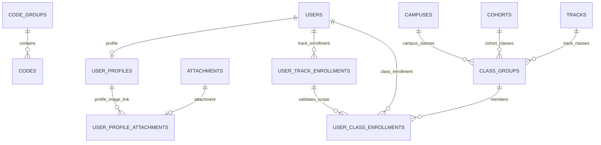
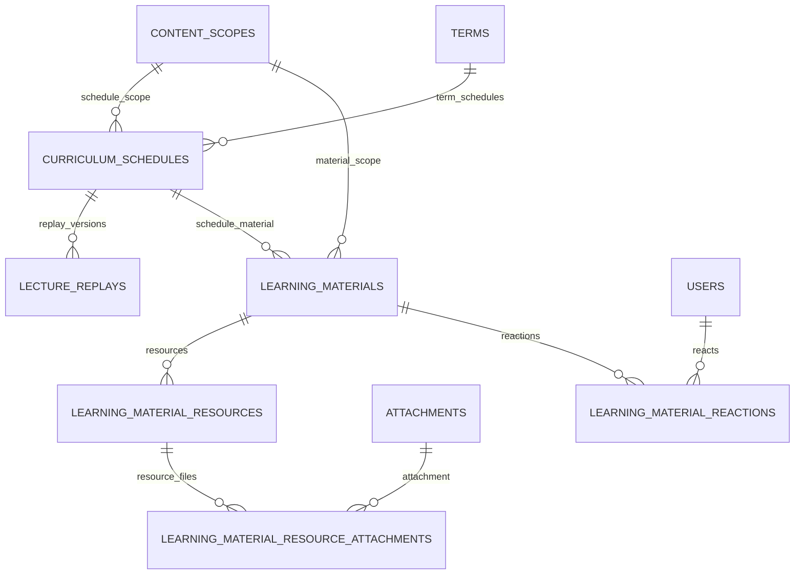
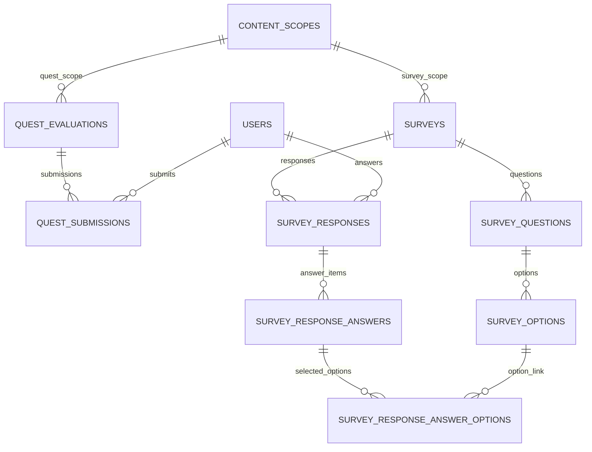
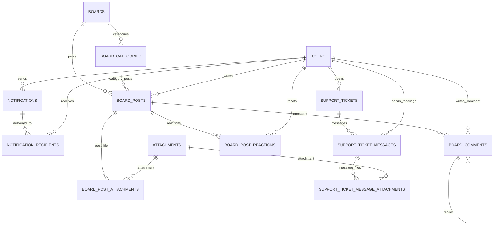
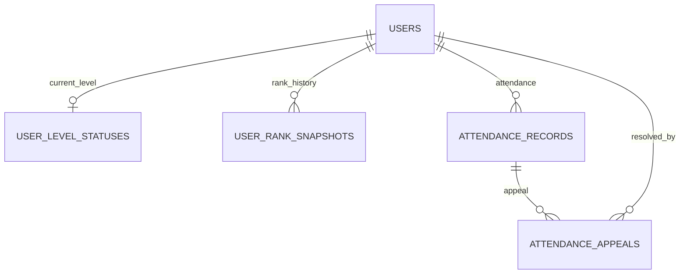

# 영역별 Mermaid ERD (revised schema 기준)

## 문서 목적
이 문서는 `docs/revised_schema_mysql8.sql`을 기준으로 **영역별로 분리한 Mermaid `erDiagram`** 모음입니다.
전체 스키마를 한 장에 넣지 않고, 도메인별로 읽기 쉽게 나눈 발표/문서화용 버전입니다.

## 작성 원칙
- 기준 스키마: `docs/revised_schema_mysql8.sql`
- 공통 엔티티(`users`, `tracks`, `attachments`, `content_scopes`)는 필요한 영역에 중복 표기합니다.
- 각 다이어그램은 해당 영역 이해에 필요한 관계만 포함합니다.

## 1. Core / Identity / Organization

## 2. Scope / Learning

## 3. Assessment

## 4. Communication

## 5. Operations

## 활용 가이드
- 발표 자료에는 각 섹션을 별도 슬라이드로 분리하는 것이 좋습니다.
- 전체 구조 설명은 `ERD.md`, 도메인 경계 설명은 `DOMAIN_SPLIT.md`, 역할 설명은 `ROLE_MATRIX.md`와 함께 사용하면 좋습니다.
