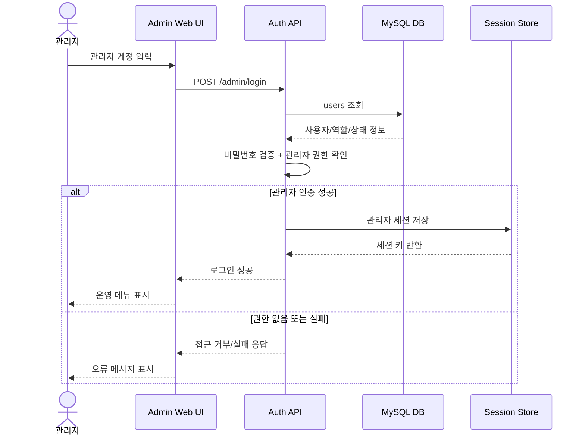
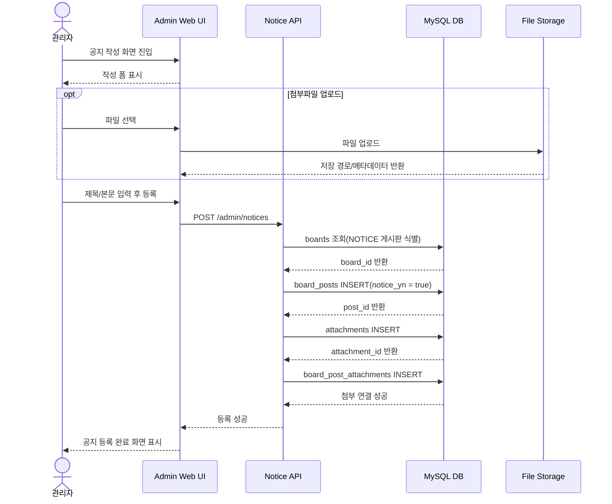
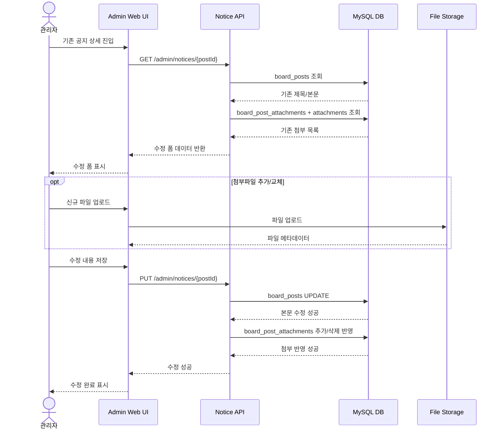
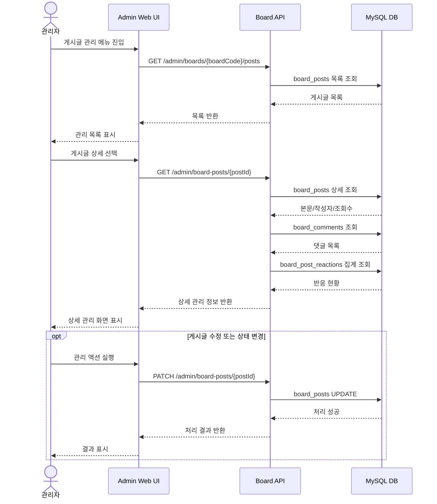
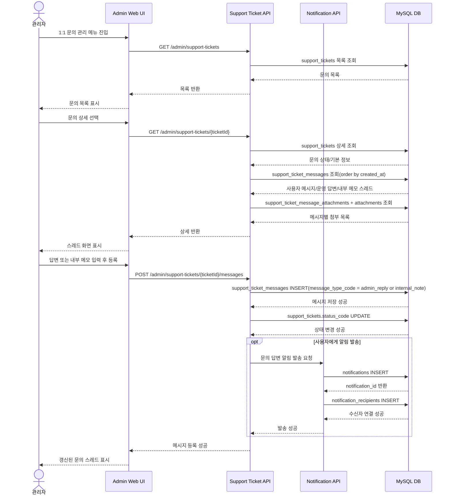
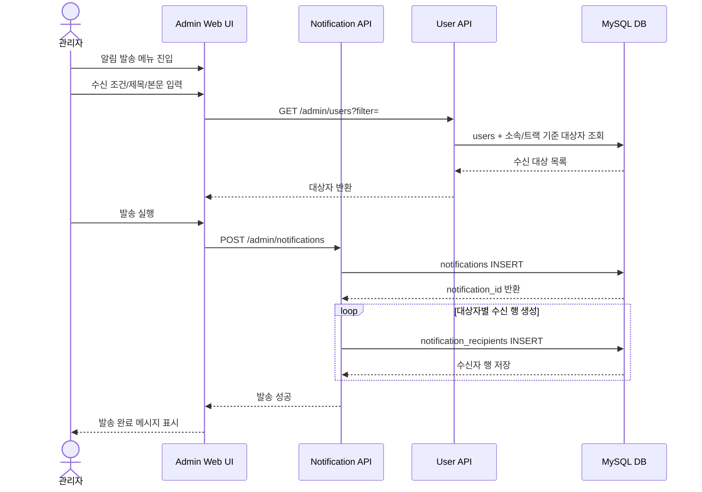
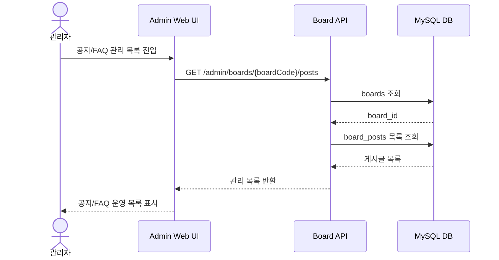

# SSAFY 상세 시퀀스 다이어그램 - 관리자

## 작성 원칙
- 관리자 기능도 **기능 단위로 분리**
- 단순 조회보다 **등록/수정/답변/발송 같은 운영 행위 중심**으로 작성
- UI, API, DB, 파일 저장소를 함께 표현

---

## 1) 관리자 로그인 및 운영 메뉴 진입

---

## 2) 공지 등록

---

## 3) 공지 수정

---

## 4) 게시글 관리(상세 조회 및 상태 조치)

---

## 5) 1:1 문의 조회 및 메시지 답변 등록

---

## 6) 사용자 대상 알림 발송

---

## 7) FAQ/공지 목록 운영 조회

