# SSAFY 상세 시퀀스 다이어그램 - 학습자

## 작성 원칙
- **기능 1개 = 시퀀스 다이어그램 1개**로 분리
- 화면(UI), 애플리케이션 서비스, DB, 파일 저장소/뷰어를 구분
- 현재 확보된 캡처와 기능명세를 기준으로 작성
- 미확보 상세(Quest 상세, Survey 상세 일부)는 현재 요구사항 수준에서 보수적으로 표현

## 공통 참여자 표기
- `Web UI`: 브라우저 화면
- `Auth API`: 인증/인가 처리
- `App API`: 도메인별 애플리케이션 서비스
- `MySQL DB`: 정규화 스키마 기준 DB
- `File Storage`: 첨부/프로필 이미지 저장소
- `Viewer`: eBook/PDF 새 창 뷰어

---

## 1) 로그인 후 세션 생성 및 메인 진입

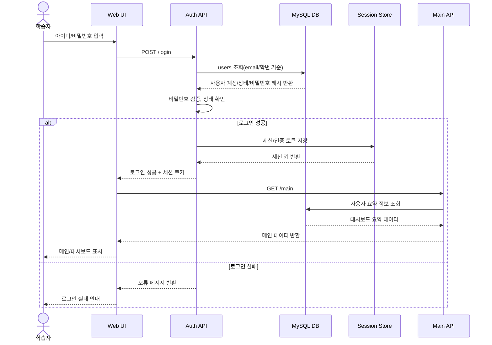

---

## 2) 메인 대시보드 조회(알림/출결/레벨 위젯)

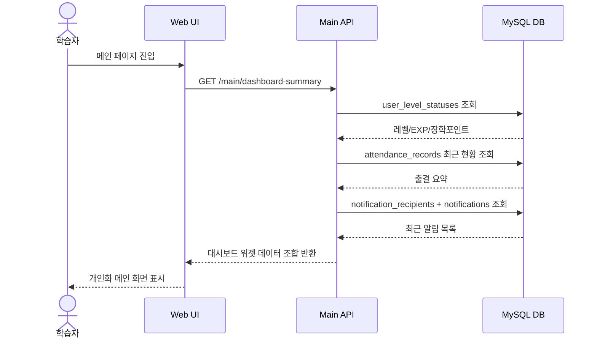

---

## 3) 알림함 조회 및 읽음 처리

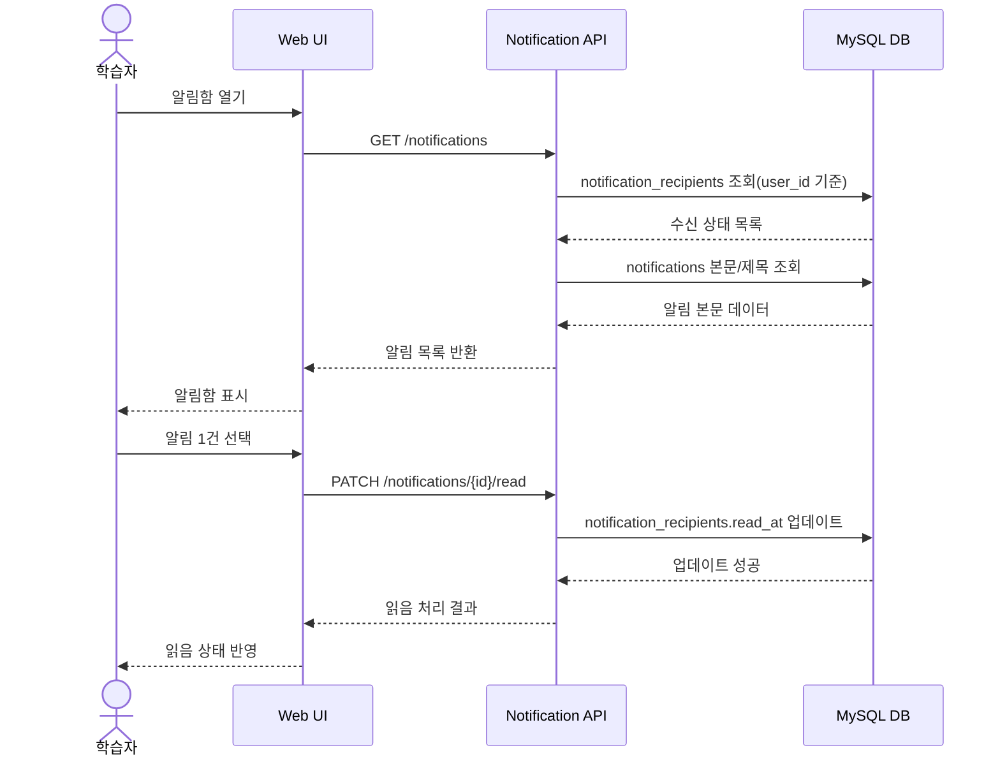

---

## 4) 출결 현황 조회 및 소명서 진입

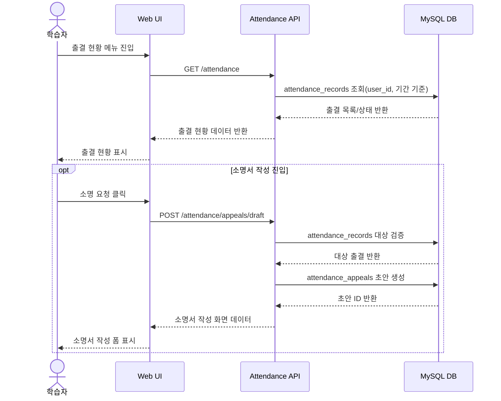

---

## 5) 커리큘럼 조회

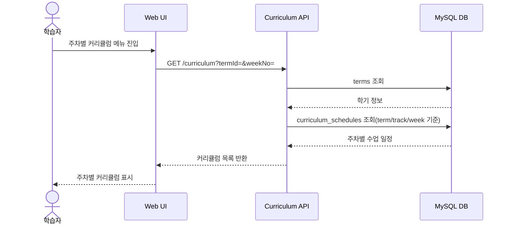

---

## 6) 학습자료 목록 조회 → 상세 조회

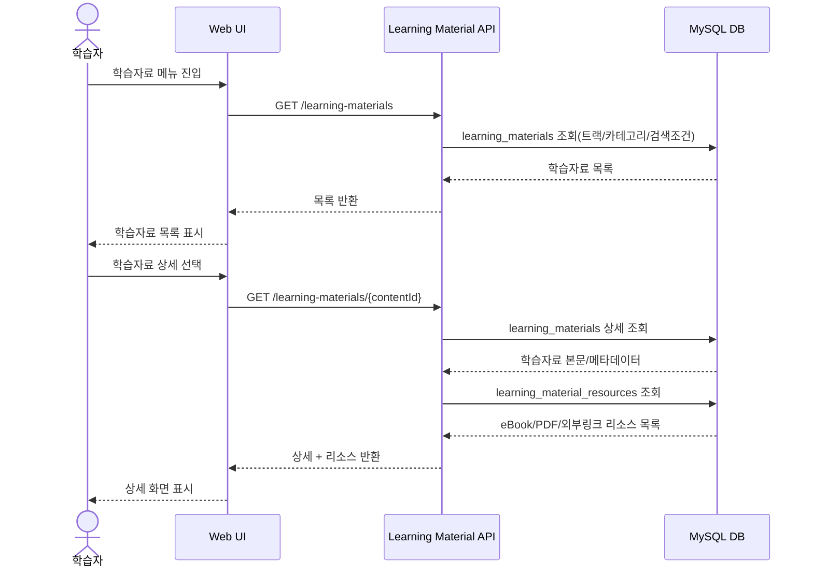

---

## 7) 학습자료 상세 → eBook/PDF 새 창 열기

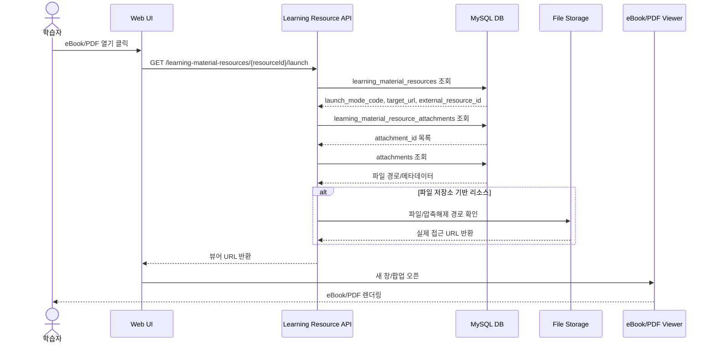

---

## 8) 자유게시판 목록 → 상세 → 댓글 작성

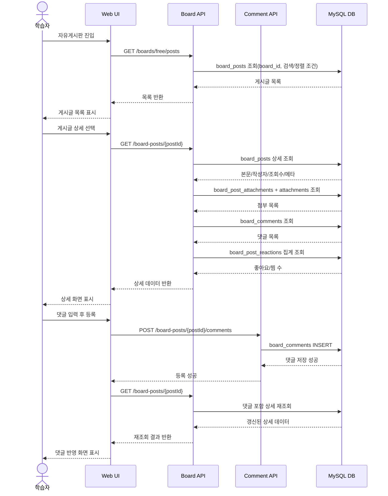

---

## 9) 자유게시판 반응(좋아요/찜) 처리

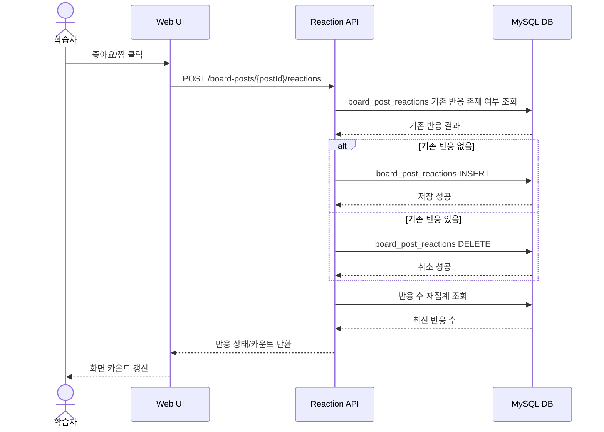

---

## 10) 공지사항 목록 → 상세 조회

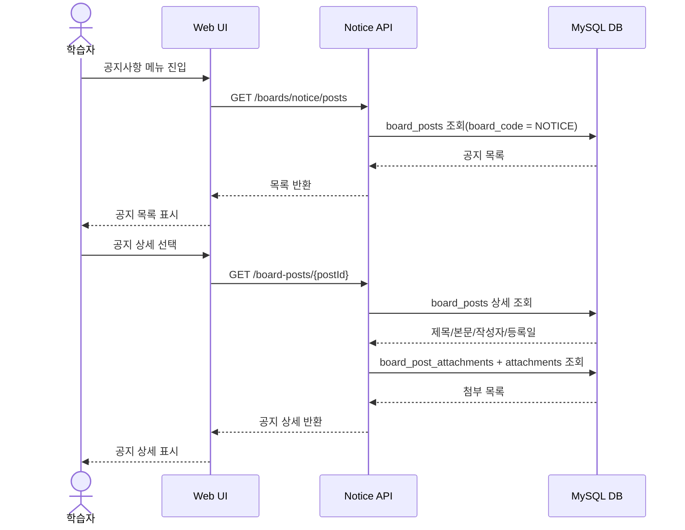

---

## 11) 1:1 문의 등록

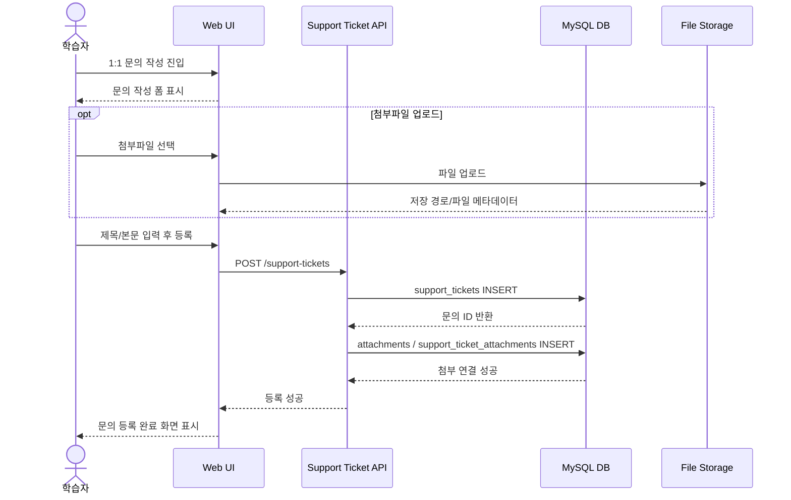

---

## 12) 회원정보 수정

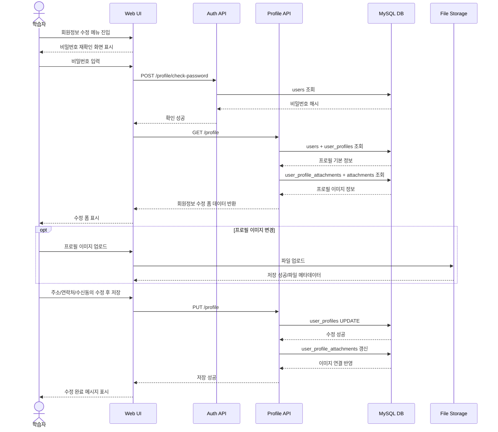

