# SSAFY 유스케이스 다이어그램

## 기준
- `REQUIREMENTS.md`
- `FUNCTIONAL_SPEC.md`
- `ERD.md`
- `ROLE_MATRIX.md`

## Mermaid

```mermaid
flowchart LR
    student[학생]
    instructor[선생]
    manager[운영자]
    admin[관리자]

    subgraph auth[인증/계정]
        uc_login([로그인])
        uc_find_password([비밀번호 찾기])
        uc_check_password([비밀번호 확인])
        uc_edit_profile([회원정보 수정])
        uc_profile_image([프로필 이미지 변경])
    end

    subgraph dashboard[메인/대시보드]
        uc_view_main([메인/대시보드 조회])
        uc_view_notifications([알림함 조회])
        uc_read_notification([알림 읽음 처리])
        uc_view_attendance([출결 현황 조회])
        uc_view_level([레벨/장학포인트 조회])
    end

    subgraph learning[학습]
        uc_view_curriculum([커리큘럼 조회])
        uc_manage_curriculum([커리큘럼 운영])
        uc_view_replay([다시보기 조회])
        uc_manage_replay([다시보기 등록/관리])
        uc_view_materials([학습자료 목록 조회])
        uc_manage_materials([학습자료 등록/배포])
        uc_open_ebook([eBook/PDF 열기])
        uc_view_quest([Quest/평가 조회])
        uc_submit_quest([Quest 제출])
        uc_grade_quest([Quest 채점/피드백])
        uc_view_survey([설문 조회])
        uc_submit_survey([설문 응답 제출])
        uc_manage_survey([설문 생성/배포])
    end

    subgraph community[커뮤니티/공지]
        uc_view_board_list([게시판 목록 조회])
        uc_view_board_detail([게시글 상세 조회])
        uc_write_post([게시글 작성])
        uc_write_comment([댓글 작성])
        uc_react_post([좋아요/찜 반응])
        uc_manage_notice([공지 관리])
        uc_manage_board([게시판 운영 관리])
    end

    subgraph support[문의]
        uc_create_ticket([1:1 문의 등록])
        uc_view_ticket([1:1 문의 조회])
        uc_reply_ticket([1:1 문의 답변 메시지 작성])
        uc_note_ticket([1:1 문의 내부 메모 작성])
    end

    subgraph ops[운영]
        uc_send_notification([알림 발송])
        uc_process_attendance([출결 정정/소명 처리])
        uc_manage_user([사용자 상태 관리])
        uc_manage_policy([역할/권한/코드 관리])
    end

    student --> uc_login
    student --> uc_find_password
    student --> uc_check_password
    student --> uc_edit_profile
    student --> uc_view_main
    student --> uc_view_notifications
    student --> uc_view_attendance
    student --> uc_view_level
    student --> uc_view_curriculum
    student --> uc_view_replay
    student --> uc_view_materials
    student --> uc_open_ebook
    student --> uc_view_quest
    student --> uc_submit_quest
    student --> uc_view_survey
    student --> uc_submit_survey
    student --> uc_view_board_list
    student --> uc_view_board_detail
    student --> uc_write_post
    student --> uc_write_comment
    student --> uc_react_post
    student --> uc_create_ticket
    student --> uc_view_ticket

    instructor --> uc_view_curriculum
    instructor --> uc_manage_curriculum
    instructor --> uc_manage_replay
    instructor --> uc_manage_materials
    instructor --> uc_view_quest
    instructor --> uc_grade_quest
    instructor --> uc_manage_survey
    instructor --> uc_view_ticket
    instructor --> uc_reply_ticket
    instructor --> uc_process_attendance

    manager --> uc_manage_notice
    manager --> uc_manage_board
    manager --> uc_send_notification
    manager --> uc_view_ticket
    manager --> uc_reply_ticket
    manager --> uc_note_ticket
    manager --> uc_process_attendance
    manager --> uc_manage_user

    admin --> uc_manage_notice
    admin --> uc_manage_board
    admin --> uc_send_notification
    admin --> uc_reply_ticket
    admin --> uc_note_ticket
    admin --> uc_manage_user
    admin --> uc_manage_policy
    admin --> uc_manage_curriculum
    admin --> uc_manage_materials
    admin --> uc_manage_survey

    uc_edit_profile --> uc_check_password
    uc_edit_profile --> uc_profile_image
    uc_view_main --> uc_view_notifications
    uc_view_main --> uc_view_attendance
    uc_view_main --> uc_view_level
    uc_view_materials --> uc_open_ebook
```

## 메모
- Mermaid는 UML 전용 use case 문법이 제한적이라, **flowchart 기반으로 유스케이스 다이어그램 형태**로 표현했습니다.
- 역할 체계는 **4역할(student / instructor / manager / admin)** 기준으로 정리했습니다.
- 운영 정책 설명 시에는 이를 **학습자 / 실무 운영자 / 시스템 관리자**의 3레벨로 묶어 해석할 수 있습니다.
